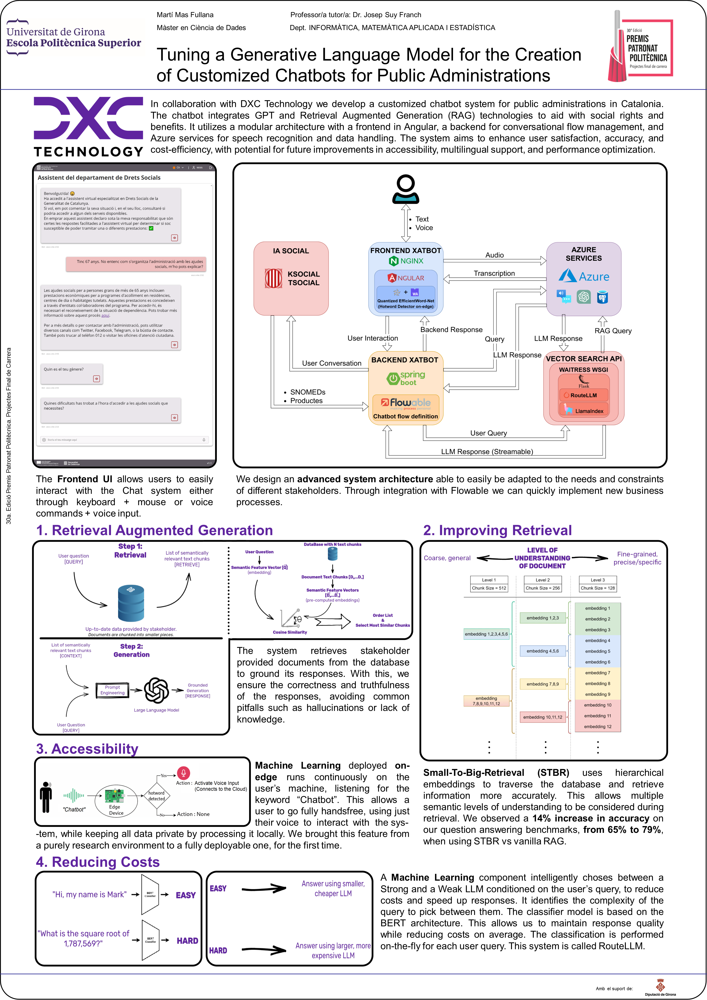

# Tuning a Generative Language Model for the Creation of Customized Chatbots for Public Administrations
This repository contains the LaTeX source files and compiled PDFs for my Master's Thesis titled **"Tuning a Generative Language Model for the Creation of Customized Chatbots for Public Administrations"**. This project is part of my Data Science Master's Degree at _**Universitat de Girona**_ (UdG), developed in collaboration with **DXC Technology**, under the supervision of Josep Suy Franch (UdG) and Miquel Tarragona Margarit (DXC Technology).

The compiled PDF files are:
  1. The full Master's Thesis report, documenting the entire project [[PDF](TFM_MartíMasFullana/TFM_MartíMasFullana.pdf)]
  2. A 5 page summary of the full report [[PDF](TFM_MartíMasFullana_Summary/TFM_MartíMasFullana_Summary.pdf)]
  3. A Catalan version of the 5 page summary [[PDF](TFM_MartíMasFullana_Summary_Catalan/TFM_MartíMasFullana_Summary_Catalan.pdf)]

## Table of Contents
- [Technical Poster](#technical-poster)
- [Project Explainer Video](#project-explainer-video)
- [Acknowledgements](#acknowledgements)
- [Bibliography](#bibliography)

## Technical Poster

## Project Explainer Video
<!-- https://github.com/user-attachments/assets/1f2ff448-7d19-4ae4-92bb-14798b5a7fbd -->
<video controls src="Video Premis Patronat.mp4" title="Video" muted="false"></video>
Video Premis Patronat.mp4

## Acknowledgements
I would like to express my gratitude to my tutor Josep Suy Franch for his guidance and support throughout the development of this project. I would also like to thank Benjamí Fuertes, Sergi Martinez and Joan Oller for their hard work and dedication to the project, and for their patience answering my questions, as well as thank DXC Technology for providing me with this opportunity. I thank my family and friends for their encouragement and understanding during this time. Finally, I would like to thank my fiancée for her unwavering love and support.

## Bibliography
- **[Abushawar 2015]** _ALICE chatbot: Trials and outputs_. Computación y Sistemas, 19. [DOI: 10.13053/cys-19-4-2326](https://doi.org/10.13053/cys-19-4-2326)
- **[Lewis 2021]** _Retrieval-Augmented Generation for Knowledge-Intensive NLP Tasks_. arXiv. [URL](https://arxiv.org/abs/2005.11401)
- **[Radford 2018]** _Improving Language Understanding by Generative Pre-Training_. [URL](https://cdn.openai.com/research-covers/language-unsupervised/language_understanding_paper.pdf)
- **[Radford 2019]** _Language Models are Unsupervised Multitask Learners_. [URL](https://cdn.openai.com/better-language-models/language_models_are_unsupervised_multitask_learners.pdf)
- **[Brown 2020]** _Language Models are Few-Shot Learners_. arXiv. [URL](https://arxiv.org/abs/2005.14165)
- **[Ouyang 2022]** _Training language models to follow instructions with human feedback_. arXiv. [URL](https://arxiv.org/abs/2203.02155)
- **[Schulman 2017]** _Proximal Policy Optimization Algorithms_. arXiv. [URL](https://arxiv.org/abs/1707.06347)
- **[Sutskever 2014]** _Sequence to Sequence Learning with Neural Networks_. arXiv. [URL](https://arxiv.org/abs/1409.3215)
- **[Vaswani 2023]** _Attention Is All You Need_. arXiv. [URL](https://arxiv.org/abs/1706.03762)
- **[Weizenbaum 1966]** _ELIZA: A computer program for the study of natural language communication between man and machine_. Commun. ACM, 9(1), 36–45. [DOI: 10.1145/365153.365168](https://doi.org/10.1145/365153.365168)
- **[Chidhambararajan 2022]** _EfficientWord-Net: An Open Source Hotword Detection Engine Based on Few-Shot Learning_. Journal of Information & Knowledge Management, 21(04), 2250059. [DOI: 10.1142/S0219649222500599](https://doi.org/10.1142/S0219649222500599)
- **[Zhang 2023]** _Post-training Quantization for Neural Networks with Provable Guarantees_. arXiv. [URL](https://arxiv.org/abs/2201.11113)
- **[ONNX Community 2024]** _ONNX: Open Neural Network Exchange_. [URL](https://onnx.ai)
- **[World Wide Web Consortium (W3C) 2024]** _WebAssembly: A binary instruction format for a stack-based virtual machine_. [URL](https://webassembly.org/)
- **[He 2015]** _Deep Residual Learning for Image Recognition_. arXiv. [URL](https://arxiv.org/abs/1512.03385)
- **[Radford 2022]** _Robust Speech Recognition via Large-Scale Weak Supervision_. arXiv. [URL](https://arxiv.org/abs/2212.04356)
- **[Malkov 2018]** _Efficient and robust approximate nearest neighbor search using Hierarchical Navigable Small World graphs_. arXiv. [URL](https://arxiv.org/abs/1603.09320)
- **[Xian 2020]** _Zero-Shot Learning -- A Comprehensive Evaluation of the Good, the Bad and the Ugly_. arXiv. [URL](https://arxiv.org/abs/1707.00600)
- **[OpenAI 2024]** _Hello GPT-4o_. [URL](https://openai.com/index/hello-gpt-4o/)
- **[HuggingFace 2023]** _What is a Mixture of Experts (MoE)?_. [URL](https://huggingface.co/blog/moe#what-is-a-mixture-of-experts-moe)
- **[Betts 2023]** _Peering Inside GPT-4: Understanding its Mixture of Experts (MoE) Architecture_. Medium. [URL](https://medium.com/@seanbetts/peering-inside-gpt-4-understanding-its-mixture-of-experts-moe-architecture-2a42eb8bdcb3)
- **[Es 2023]** _RAGAS: Automated Evaluation of Retrieval Augmented Generation_. arXiv. [URL](https://arxiv.org/abs/2309.15217)
